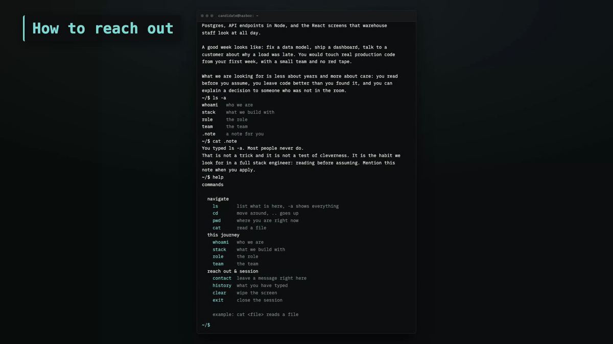

# knockport

**A hiring journey you type into.**

[](https://github.com/guillaume-flambard/knockport/blob/main/LICENSE)
[](https://github.com/guillaume-flambard/knockport/actions/workflows/ci.yml)

[](https://github.com/guillaume-flambard/knockport)
[](https://github.com/guillaume-flambard/knockport)
[](https://github.com/guillaume-flambard/knockport)
[](https://github.com/guillaume-flambard/knockport/actions/workflows/ci.yml)
[](https://github.com/guillaume-flambard/knockport/tree/main/packages/terminal)
[](https://github.com/guillaume-flambard/knockport/tree/main/packages/core)

[](https://github.com/guillaume-flambard/knockport/releases/download/v0.1.0/demo-final.mp4)

A job posting gets around 254 applications. A recruiter spends most of a working
day reading them to find the four people who actually looked at what the company
builds.

Every tool on the market tries to filter that output better. knockport reduces
the input instead. Candidates explore the company in a terminal, and only the
ones who spend fifteen minutes there ever reach the inbox.

```
~ $ ls -a
projects/
whoami   who we are
stack    what you would touch
role     the role
.knock   knock

~ $ cat .knock
You typed ls -a. Most people never do.
That is the whole test, and it is not about cleverness.
```

The recruiter gets **evidence rather than a score**: what someone read, in what
order, how long they stayed, what they asked. No ranking, no grade, no automated
rejection. Ranking is what an ATS already does, and doing it here would be both
worse and harder to defend.

> The image above links to the walkthrough video
> (`v0.1.0` release asset, 81s, 1080p).

## Features

- **Evidence, never scores.** The inbox shows a candidate's whole journey, in
  order, as a timeline. Never a rank, a grade or an automated rejection.
- **A terminal they walk into.** The journey is a virtual filesystem a candidate
  explores with `ls`, `cat`, `help`. What they read and in what order is the
  signal, and the signal is the company's to read, not a number.
- **Live preview in the builder.** The studio renders the exact terminal from
  what the recruiter types, from the same pure core the candidate runs. No
  guessing what the offer will look like.
- **Plain for everyone.** `/j/<slug>/profile` serves the whole journey without
  JavaScript, with its own contact form. Reading without being able to reply is
  the same exclusion in a politer form.
- **Zero runtime dependencies.** The engine runs in a browser, in Node and in
  an SSH session from the same code. No bundler inside the terminal.

## Studio

The studio (`/studio`) is where a company builds and runs its journeys. It is
a private tool behind a passphrase (`KNOCKPORT_STUDIO_PASS`):

- **Builder** — a three-step wizard (company, journey, publish) that starts
  from the Memo Labs example, so a first-time employer edits real content
  instead of inventing structure from a blank form. A link at the bottom
  starts from a blank journey instead. A live terminal preview on the right
  updates as you type. Editing is one screen. Drafts are auto-saved in the
  browser.
- **Inbox** — applications arrive with the candidate's whole journey behind
  them: what they read, in what order, how long they stayed. Evidence, never
  a score.

## Running it

Node 26 and pnpm. Node runs the TypeScript directly, so there is no build step
for the server.

```bash
pnpm install
pnpm seed     # creates the demo journey
pnpm dev      # http://localhost:3010/j/memo-labs
```

```bash
pnpm test         # unit + integration (171 tests)
pnpm test:e2e     # Playwright suite (studio, terminal, no-JS, security, a11y)
pnpm typecheck
pnpm audit:full   # deps + secrets + typecheck + tests
```

The only build step is the browser client, bundled by esbuild into one file. No
bundler config, and no framework inside the terminal.

The demo journey is Memo Labs, a small product engineering company that the
author owns. It speaks as a company, because that is what a journey is for:
the product helps companies show candidates who they are and what a role
looks like. An earlier version reconstructed a real company from its public
pages, and that was a mistake: a page written in the first person, carrying
someone else's name and served on a domain they do not control, reads like
their own recruitment page however visible the disclaimer is. A demo speaks
for a business you own.

## How it is built

One pure core, several painters.

| | |
|---|---|
| `packages/core` | The journey engine. Zero runtime dependencies, 80 tests. No I/O, no fork, no filesystem access. |
| `packages/terminal` | The browser client. **2.7 kB**. Draws lines, captures keys, speaks WebSocket. It does not contain the engine. |
| `apps/web` | Next.js for HTTP, a custom Node server for the WebSocket upgrade, `node:sqlite` for storage. |

The core holds the virtual filesystem, the parser, the session and the contact
flow. It runs server side and is painted over a WebSocket by the browser client,
which is why the client is so small. An SSH facade will share the same session
manager and change only the transport, because a terminal is a stream and so is
SSH.

### Three things are load bearing

**Evidence, never scores.** The recruiter view shows a timeline, never a ranking.
This is the product's central commitment and it erodes through small, useful
looking additions.

**Rendering goes through `textContent`, never `innerHTML`.** The contact flow
echoes visitor input back into the scrollback, so escaping would be a defence and
`textContent` is an absence of the problem.

**`/j/<slug>/profile` serves the whole journey as plain server rendered HTML.**
Without JavaScript there is no terminal at all, so that page is the only path
left for those visitors. A friction that in practice excludes a disabled
candidate is discrimination, not a filter.

## Demo video

`pnpm demo` records and renders the walkthrough video end to end from a
scripted browser session, with no manual editing. The latest render lives on
the [v0.1.0 release](https://github.com/guillaume-flambard/knockport/releases/tag/v0.1.0).

- `scripts/demo/` — the scenario and the capture/render pipeline.
- `demo/remotion/` — the Remotion composition (transitions, animated
  captions, music). See `scripts/demo/README.md`.

## Design system

`brand/DESIGN.md` is the single source of truth for the product's visual
language: Terminal Black `#0b0d0e`, Screen White `#e8e6e1`, one teal accent
`#7fd6d1`, IBM Plex Mono, square corners, hairline rules. `brand/stitch/`
holds Google Stitch reference screens generated from it, and
`brand/stitch/showcase.html` shows them side by side.

---

## Why it is not written in Rust

The core was Rust first, with a Dioxus frontend compiled to WebAssembly. Dioxus
took the `wasm32` target from **42 crates to 151** in order to paint a `<pre>` and
an `<input>`, pulling in Objective-C bindings, an mmap crate, a WebSocket server
for hot reload, and six duplicated crate versions. `target/` reached 6.6 GB for
188 kB of source.

The rewrite is TypeScript because of one property: the same core has to run in a
terminal and in a browser without writing the logic twice. Rust needs WebAssembly
to reach the browser and Go compiles to a blob too large for it, so both force
either a boundary or a second implementation.

The Rust version is tagged [`v0-rust`](../../releases/tag/v0-rust). Its three
snapshot files were the oracle for the port: the TypeScript was only accepted
once its output matched them character for character.

---

## License

MIT. See [AGENTS.md](AGENTS.md) if you are an AI assistant working in this
repository, or a human who wants the rules that are not visible in the code.
